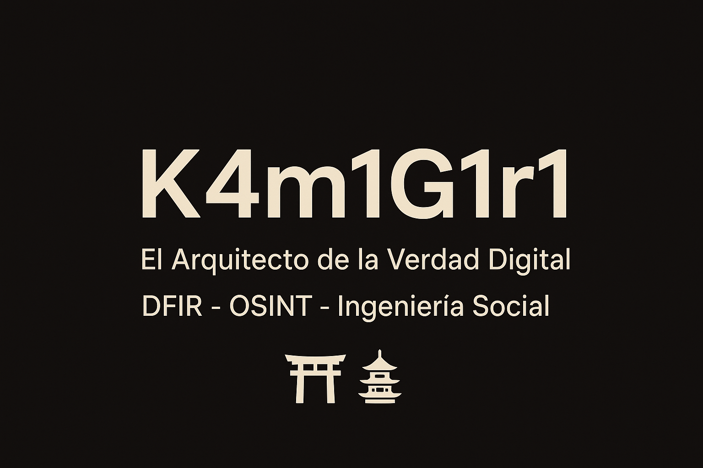

# 

## 🩸👑「K4M1G1R1: The Eternal Path」⚙️ 「TENSHI NO SŌZŌ: El Arquitecto del Zero Control」 ⚙️

---

## 🏗️ Ingeniería de la Sombra — Manifiesto del Arquitecto

I don’t just break systems; I engineer the physics of their failure and the architecture of their unbreakability. I create. I control.

⚡ Arquitecto

- Mi obsesión es la concurrencia, el bajo nivel (C/Rust/Go) y la arquitectura modular. Diseño el malware con la misma disciplina que diseño la defensa.

💀 Control

- Cada payload es un experimento, cada exploit un informe de ingeniería. Mis creaciones son IP (Propiedad Intelectual), nunca caos.

Visión

- Mi código es mi cimiento; mi destino, el liderazgo.

Este repositorio es la bitácora de mi transformación: `de tecnólogo de bases a Arquitecto de Amenazas.` Es un registro público de la ingeniería necesaria para fundar el Unicornio de Ciberseguridad más avanzado.

---

## 🎯 Purpose of this Repo

This repository is the **single source of truth** for everything I do on the Roadmap:

- Daily logs and rituals (Journal/)  
- Lab writeups and forensic artifacts (Labs/)  
- Reverse-engineering experiments (Reversing/)  
- Language progress and cultural absorption (Languages/)  
- Readings, notes and actionable summaries (Readings/)  
- Projects aligned only to the Roadmap (Projects/)  
- The Roadmap itself and its iterative updates (Roadmap/)

Everything here documents the **process**, not just the result. Anybody can read it; few will understand. Survival is optional.

---

## 📂 Repo structure (quick map)

-  # This file — the scripture
- 
  - 
- 
  - 
  -  # TryHackMe writeups
  -  # HackTheBox writeups
- 
  - 
  -  # apks, smali notes, frida scripts
  -  # binarios Linux/Windows, gdb notes
  -  # dumps, binwalk results
  -  — scripts útiles (frida snippets, patchers)
  -  # CVEs encontrados y estudiados
- 
  - 
  - 
- 
  - 
- 
  - 
  - 
- 
  - 

---

## 🔧 How to use this Grimoire

- **If you are me (Yukiharu):** use it as a daily ritual. Create a new `Journal/YYYY-MM-DD.md` entry every night. Push small commits — each is proof of discipline.  
- **If you are a curious soul:** read `Roadmap/roadmap.md` first to understand context, then pick a lane (Labs, Reversing, or Journal).  
- **If you are a defender or vendor:** contact me for responsibly redacted PoCs or coordinated disclosure. See Responsible Disclosure below.

---

## 🧠 What goes in each major folder (rules)

- **Roadmap/** — canonical plan. Every modification must be versioned and dated.  
- **Labs/** — writeups must follow the `labs-writeup-template.md` (metadata, recon, exploitation, post-exploitation, remediations, reflections). Keep `artifacts/` local.  
- **Reversing/** — experiments, notes, Frida scripts, Ghidra findings. Never commit raw APKs or firmware with secrets.  
- **Languages/** — raw practice logs. Track minutes and retention.  
- **Journal/** — raw, uncensored logs (emotion, ritual, results). Not polished; honest.  
- **Projects/** — only projects aligned with the Roadmap. No side-money hacks that distract from the path.

---

## 🧾 Templates & standards (use them)

- `Journal/entry-template.md` — daily entry format (mood, hours, labs, reflections).  
- `Labs/labs-writeup-template.md` — canonical format for writeups.  
- `Projects/README.md` — each project must have a `plan.md` with MVP, stack, sprints, and metrics.

Use the templates to maintain consistency and credibility.

---

`Todo aquí documenta la disciplina de ingeniería y el rigor científico del proceso, más allá del resultado final.`

---

## 🛡 Ética y Divulgación de Propiedad Intelectual (No Negociable)

- Mi ambición de Unicornio se basa en la confianza y el control.

  - Todos los experimentos de Malware Controlled y Exploit PoCs se realizan en laboratorios privados, aislados (air-gapped) y bajo mi control legal.

  - La IP ofensiva se utiliza para diseñar productos de defensa insuperables y para la venta exclusiva a entidades gubernamentales aliadas.

  - Se mantiene la estricta Divulgación Responsable (Responsible Disclosure) para todas las vulnerabilidades encontradas en vendors. PGP public key disponible.

---

## 🚨 Advertencia Final (Legal y Existencial)

**Este es un GRIMOIRE DE INGENIERÍA — metódico, disciplinado y diseñado para la dominación del mercado. No se lee, se estudia.**

`Codename: TENSHI NO SŌZŌ (天使の創造) — El Arquitecto.`

∴ FrΔctured RΣΔL1DΔD • C2 Protocolo 0.1 • H.Q. PENDING
