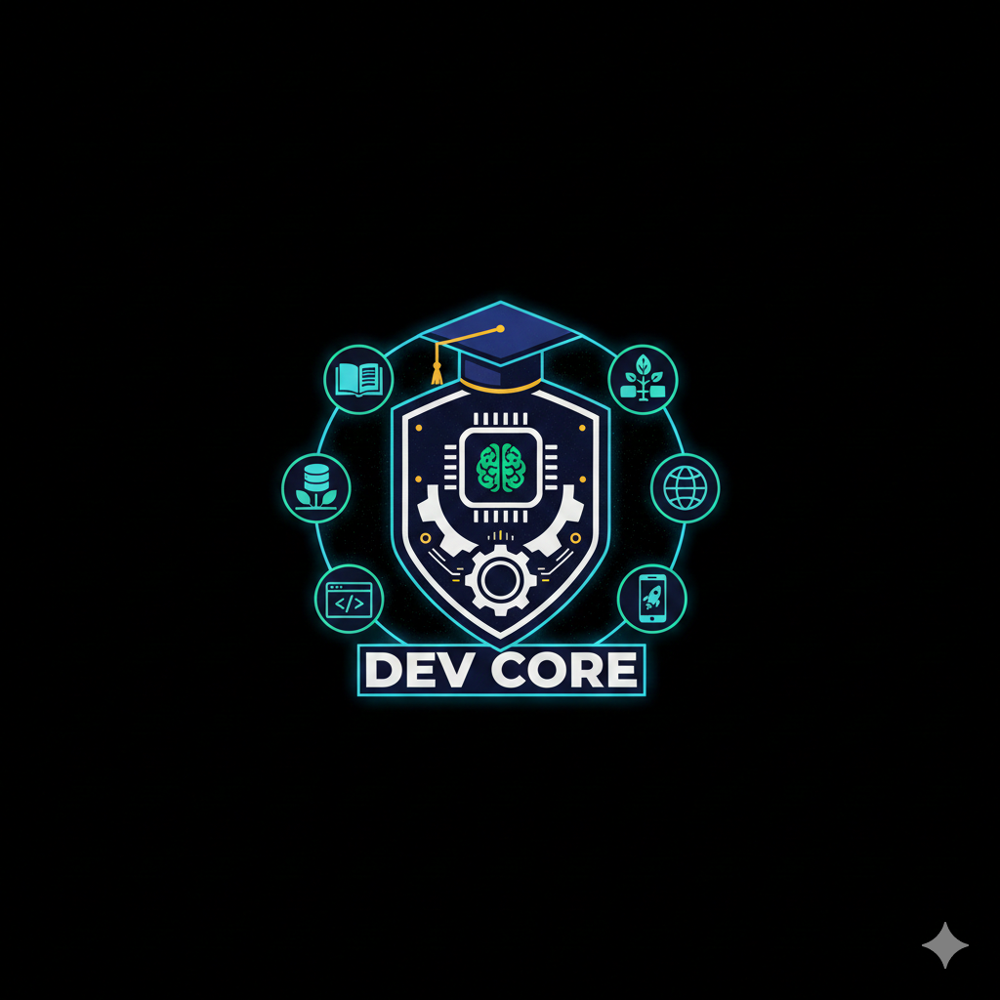

# 👋 Hola, soy Alejandro Meyer

## Tecnólogo en Desarrollo de Software | Fullstack & Mobile | Creación de productos digitales y flujo de ingresos reales

---

## 🎯 Sobre mí

Soy un Tecnólogo en Desarrollo de Software con enfoque en **aplicaciones Fullstack y móviles**, integrando buenas prácticas de seguridad, testing y despliegue profesional.  
Mi objetivo es **transformar ideas en sistemas funcionales**, construyendo portafolios activos y generando resultados medibles desde el inicio.  

---

## 🛠️ Stack & Habilidades

### Frontend

- **Lenguajes:** HTML5 (semántico), CSS3 (Flexbox, Grid, Responsive), JavaScript ES6+, TypeScript  
- **Frameworks:** React, Next.js, TailwindCSS  
- **Conceptos:** Componentes, Hooks, Estado local, Routing básico

### Backend

- Node.js, NestJS  
- Controllers, Services, Modules, DTOs  
- REST APIs, HTTP verbs & status codes  
- Autenticación y seguridad: JWT, RBAC, Hashing, OWASP Top 10  
- Bases de datos: PostgreSQL, Prisma ORM, CRUD, Joins, Transacciones, Índices básicos

### Mobile

- React Native, Expo  
- Navegación, Consumo de APIs, Estado local

### DevOps & Testing

- Deploy: Vercel, Railway, Render  
- CI simple: GitHub Actions  
- Testing: Jest, Supertest

### Control de versiones

- Git, GitHub, Buenas prácticas de commits

---

## 🚀 Proyectos Destacados

| Proyecto | Descripción | Tecnologías |
| --- | --- | --- |

---

## 📫 Contacto

| Canal | Enlace |
| --- | --- |
| LinkedIn | [linkedin.com/in/k4m1g1r1](https://www.linkedin.com/in/k4m1g1r1) |
| GitHub | [github.com/K4m1G1r1](https://github.com/K4m1G1r1) |
| Correo | <alejomeyerr@gmail.com> |

---

## ✒️ Firma Personal

                                         /\
                                        /  \
                                       /_/\_\
                                      (  🎓  )
                                      